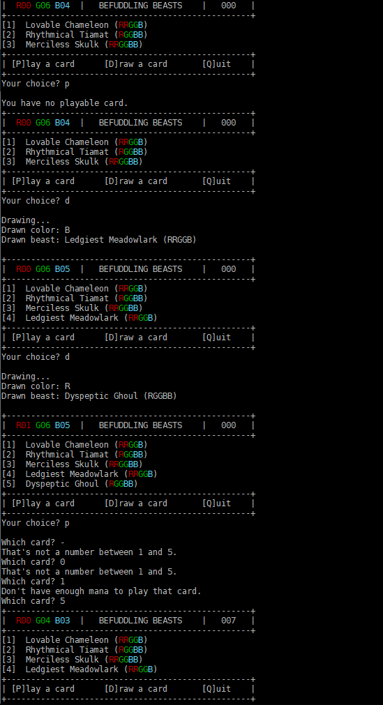

# Assignment 02

## Challenge: Befuddling Beasts Game

### Preamble

So when I was coding up the MtG: Arena drill, I was thinking "Hey - this could actually become an assignment!".

So I started to do that, and one thing led to another, and we wound up here. Life's so weird.

If you haven't done the **WEEK-03: MtG card** drill, I'd suggest doing it before continuing. Also, having any of the **WEEK-06: input validation** drills would be useful as well. Oh, and **WEEK-04: rewarder**. But not the hex grid drill - that'd be a jerk move.

**The Game Of Befuddling Beasts**

In Befuddling Beasts (just a name I made up), you have a hand of beast cards that cost a certain combination of colors (Red, Green, and Blue) to play. You also have a "pool" of colors (red, green, and blue) that you use to pay for these beasts.

On your turn, you have 3 options:

- play a beast
- draw a beast **and** a color
- quit the game

Every time you play a creature, your score goes up on a sliding scale:

- beast with cost of 1: 0 points
- beast with cost of 2 or 3: 2 points
- beast with cost of 4 or 5: 7 points
- beast with cost of 6: 10 points

The game is over when you reach 30 points (or you want to quit).

After the game is over, you will be assigned a penalty according to how many cards you have left in your hand:

- 0 cards: no penalty
- 1 card: -5 points
- 2 cards: -14 points
- 3+ cards: -10 points PER CARD

So to get a good score, you have to play beast cards...but you want to try to end the game with as few cards as possible.

---

### What you're going to build

You're going to be making an application that allows a user to play a game of Befuddling Beasts.

Each turn, the user will be shown a display that shows the player what colors they have in their pool, how many points they have, a list of the beasts they have available, and a selection of options.

They will then choose whether they want to play a beast, draw a beast & color, or quit. (There will be some validation going on here. It involves loops. It isn't fun - validation isn't really fun.)

Let's watch a couple of runs so you can get a feel for all this.

**Example Run 1**

> Commentary on Run 1
>
> - The application starts off with a welcome to the application and then "Hajime!", which means "begin!". (You don't need to write this code; it's already done for you.)
> - The user is prompted for an event. [See `Event Syntax` below for more details.]
> - The first event entered here is `14`, meaning "14 seconds pass"; notice how in the resulting display, the time remaining has gone down to 2:46.
> - The next event entered is `3 w y`; this means that 3 seconds after the last event, the (w)hite athlete scored a (y)uko.
> - Then we have a `120`; 120 seconds has passed but no poiints have been scored. Note the time - there's 38 seconds left on the clock...do you understand why?
> - Finally, we have a `2 b i` - 2 seconds after the last event, (b)lue scores an (i)ppon, which wins the match.
> - Since the match is over by ippon, the application prints out "Ippon!" and the winner (blue) is also announced. The last thing we see is a message in Japanese thanking the user.

**Example Run 2**

> Commentary on Run 2
>
> - **That** was quick - 10 seconds into the match, blue scores an ippon.

**Example Run 3**

> Commentary on Run 3
>
> - This match shows what happens if the time runs out and nobody has won outright (through ippon or awasete ippon): blue and white have the same number of waza-ari...but blue has more yuko, so blue wins on points.
> - The message no longer says "Ippon!" - instead it says "Sore made!" ("finished/time up").

**Example Run 4**

> Commentary on Run 1
>
> - In this match, white racks up a bunch of yuko - but blue answers with a waza-ari and then another one; these two together count as a special ippon ("awasete ippon") and so the match is over and blue wins again. I seem to be favouring blue. Just noticed that. Weird.

#### Event Syntax

An event will be **one line** of text entered from the keyboard. The text will be **either**:

1. \[time elapsed since last event\]
1. \[time elapsed since last event\] \[athlete colour\] \[type of point\]

The first type of event just represents the passing of time; the second one represents the passing of time AND a type of point awarded to one of the athletes.

**Examples**:

- `12`
  - this means that 12 seconds have elapsed since the last event
- `87`
  - this means that 1 minute and 27 seconds have elapsed since the last event
- `5 w y`
  - this means that 5 seconds after the last event, the white player scored a yuko
- `17 b i`
  - this means that 17 seconds after the last event, the blue player scored an ippon
- `120 w w`
  - this means that 120 seconds (2 minutes) after the last event, the white player scored a waza-ari

#### Assumptions you can make

- all user input will be valid; any text will be lowercase letters; only positive integers will be entered when numbers are expected; no invalid characters will be entered
- you can't assume that the time elapsed will not go over the amount of the match - but you don't have to worry about it if it does

#### Classes involved in this assignment

This assignment involves a number of different classes; some of them you need to make code for, while others don't need to be touched.

Here are the classes - the source code for all classes needs to go in the `src` directory:

- `ColorHelper` [done for you](ColorHelper.docs.md)
- `JudoMatch` [you need to create](JudoMatch.docs.md)
- `JudoScoreboard` [you need to create](JudoScoreboard.docs.md)
- `JudoScoringApp` [done for you](JudoScoringApp.docs.md)
- `Main` [done for you](Main.docs.md)

#### Instructions

1. create source code in `src` for a class called `JudoMatch` that passes all its tests. Further details on `JudoMatch` can be found in JudoMatch.docs.md.
1. create source code in `src` for a class called `JudoScoreboard` that passes all its tests. Further details on `JudoScoreboard` can be found in JudoScoreboard.docs.md.
