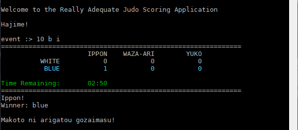
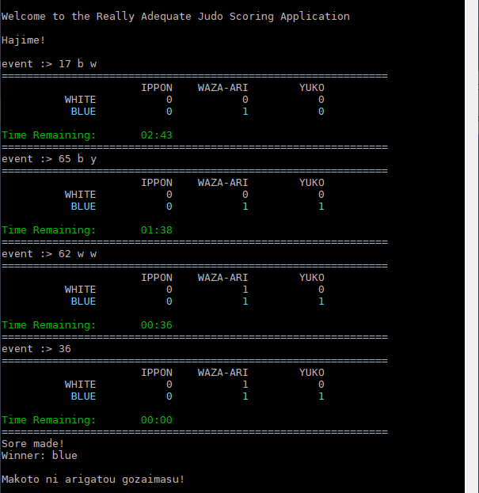
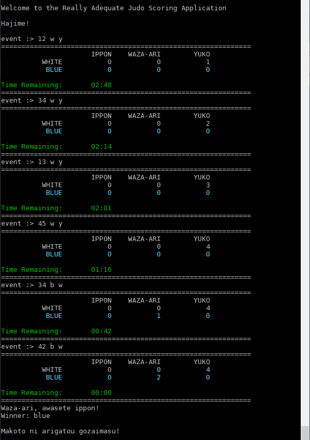

# Assignment 01

## Challenge: Judo Scoring

### Preamble

I like judo. (I practiced it for a few years when I was a younger gent. Then one day during sparring practice, I blew out my ACL. I **didn't** like that.)

The way you score a judo match is kinda...odd. [This video](https://youtu.be/6QY35qhyTbc), although aimed at youngsters, does a good job at explaining the basics of a match and how the scoring works. You can stop watching around the 4:40 mark, when they start talking about penalties. Please feel free to supplement this video with some Googling if you wish.

> Make sure you understand how the scoring works - you can't code up something you don't understand! If you have any questions, just ask me!

**IMPORTANT RULES NOTE**

We will be using the **pre-2017 rules**, so that means that we **will** be using the following:

- 2 waza-ari **does** equal an ippon, and
- yuko points **are** used

We will **not** be dealing with:

- penalties
- holds
- overtime ("Golden Score")

---

### What you're going to build

You're going to be making a program that scores a match of judo, complete with a scoreboard.

The user will enter in an "event" via the keyboard which will determine what is displayed on the scoreboard.

After every event:

- the scoreboard will display the current state of the match, showing what points each athlete has, as well as the time remaining in the match.
- the program will determine whether the match is over: this will happen when time has run out, or when someone has scored a victory (either through an ippon or 2 waza-ari).

If the match is over, a Japanese expression indicating the result is displayed, and the the winner (white or blue or tie) is announced.

Let's watch a couple of runs so you can get a feel for all this.

**Example Run 1**

> Commentary on Run 1
>
> - The application starts off with a welcome to the application and then "Hajime!", which means "begin!". (You don't need to write this code; it's already done for you.)
> - The user is prompted for an event. [See `Event Syntax` below for more details.]
> - The first event entered here is `14`, meaning "14 seconds pass"; notice how in the resulting display, the time remaining has gone down to 2:46.
> - The next event entered is `3 w y`; this means that 3 seconds after the last event, the (w)hite athlete scored a (y)uko.
> - Then we have a `120`; 120 seconds has passed but no poiints have been scored. Note the time - there's 38 seconds left on the clock...do you understand why?
> - Finally, we have a `2 b i` - 2 seconds after the last event, (b)lue scores an (i)ppon, which wins the match.
> - Since the match is over by ippon, the application prints out "Ippon!" and the winner (blue) is also announced. The last thing we see is a message in Japanese thanking the user.

**Example Run 2**

> Commentary on Run 2
>
> - **That** was quick - 10 seconds into the match, blue scores an ippon.

**Example Run 3**

> Commentary on Run 3
>
> - This match shows what happens if the time runs out and nobody has won outright (through ippon or awasete ippon): blue and white have the same number of waza-ari...but blue has more yuko, so blue wins on points.
> - The message no longer says "Ippon!" - instead it says "Sore made!" ("finished/time up").

**Example Run 4**

> Commentary on Run 1
>
> - In this match, white racks up a bunch of yuko - but blue answers with a waza-ari and then another one; these two together count as a special ippon ("awasete ippon") and so the match is over and blue wins again. I seem to be favouring blue. Just noticed that. Weird.

#### Event Syntax

An event will be **one line** of text entered from the keyboard. The text will be **either**:

1. \[time elapsed since last event\]
1. \[time elapsed since last event\] \[athlete colour\] \[type of point\]

The first type of event just represents the passing of time; the second one represents the passing of time AND a type of point awarded to one of the athletes.

**Examples**:

- `12`
  - this means that 12 seconds have elapsed since the last event
- `87`
  - this means that 1 minute and 27 seconds have elapsed since the last event
- `5 w y`
  - this means that 5 seconds after the last event, the white player scored a yuko
- `17 b i`
  - this means that 17 seconds after the last event, the blue player scored an ippon
- `120 w w`
  - this means that 120 seconds (2 minutes) after the last event, the white player scored a waza-ari

#### Assumptions you can make

- all user input will be valid; any text will be lowercase letters; only positive integers will be entered when numbers are expected; no invalid characters will be entered
- you can't assume that the time elapsed will not go over the amount of the match - but you don't have to worry about it if it does

#### Classes involved in this assignment

This assignment involves a number of different classes; some of them you need to make code for, while others don't need to be touched.

Here are the classes - the source code for all classes needs to go in the `src` directory:

- `ColorHelper` [done for you](ColorHelper.docs.md)
- `JudoMatch` [you need to create](JudoMatch.docs.md)
- `JudoScoreboard` [you need to create](JudoScoreboard.docs.md)
- `JudoScoringApp` [done for you](JudoScoringApp.docs.md)
- `Main` [done for you](Main.docs.md)

#### Instructions

1. create source code in `src` for a class called `JudoMatch` that passes all its tests. Further details on `JudoMatch` can be found in JudoMatch.docs.md.
1. create source code in `src` for a class called `JudoScoreboard` that passes all its tests. Further details on `JudoScoreboard` can be found in JudoScoreboard.docs.md.
